## BLE OTA DFU Demo

### Smartphone App:

Microchip Bluetooth Data (MBD) iOS/Android app available in stores.

### Demo steps:
1. To start the OTAU process, you need to have the upgradable firmware bin file that you generated in the previous step. You can email this file to yourself and then download it on your MBD app. Here are some screenshots that show how to save the downloaded file on your MBD app.

- **iOS Mobile**

    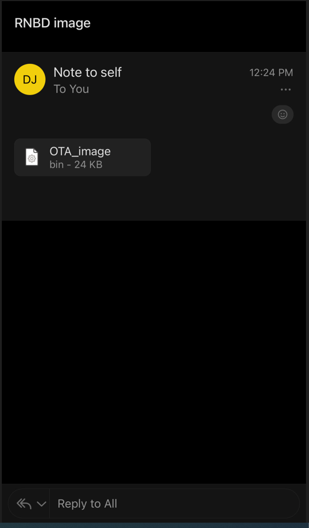

    - Please click on the binary file attached and then select the share button located at the top right corner, as shown in the screenshot below.

    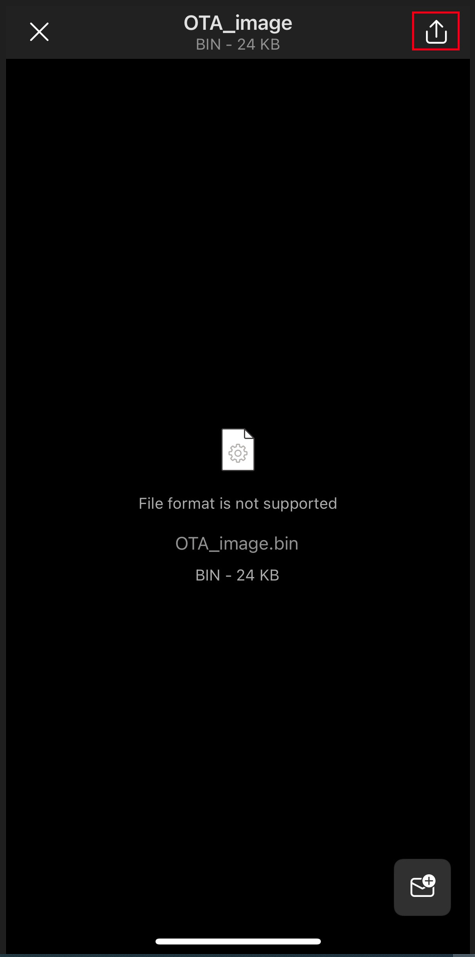

    - After clicking on the share button, please select the "Share File Via" option and then choose Microchip Bluetooth Data (MBD) app from the list of available options.

    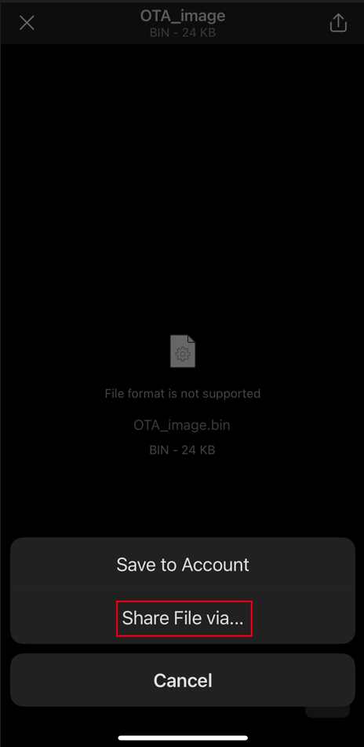

    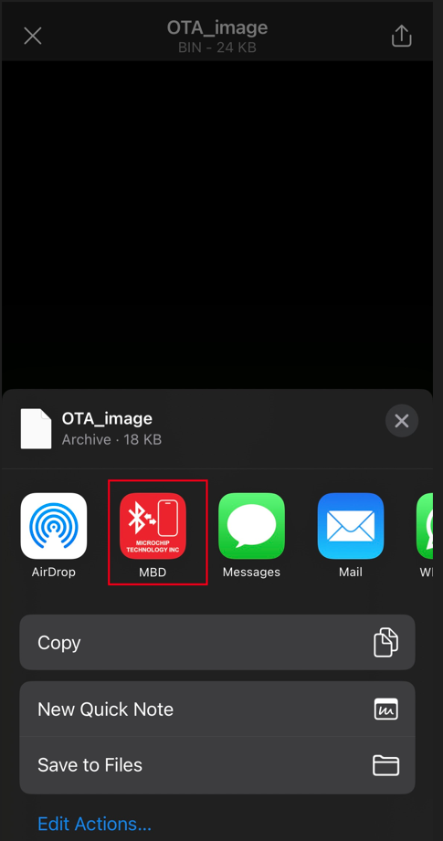

    - By following these steps, the binary file will be saved to your phone and will be available in the list of binaries to select from MBD app.

2. Turn on mobile Bluetooth and select “OTA DFU" tab of Microchip Bluetooth Data App on the mobile device.

    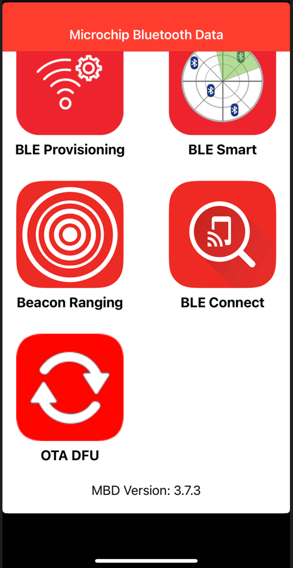

3. MBD app will request for permission to use Bluetooth and Press "OK" in the pop-up window to grant the app access to your device's Bluetooth functionality.

    

4. Power On the OTA capable target device as per the hardware setup mentioned earlier. Once the device is powered on, it should begin advertising. Click on "SCAN" button in mobile app and the device will be visible in scanned list.

    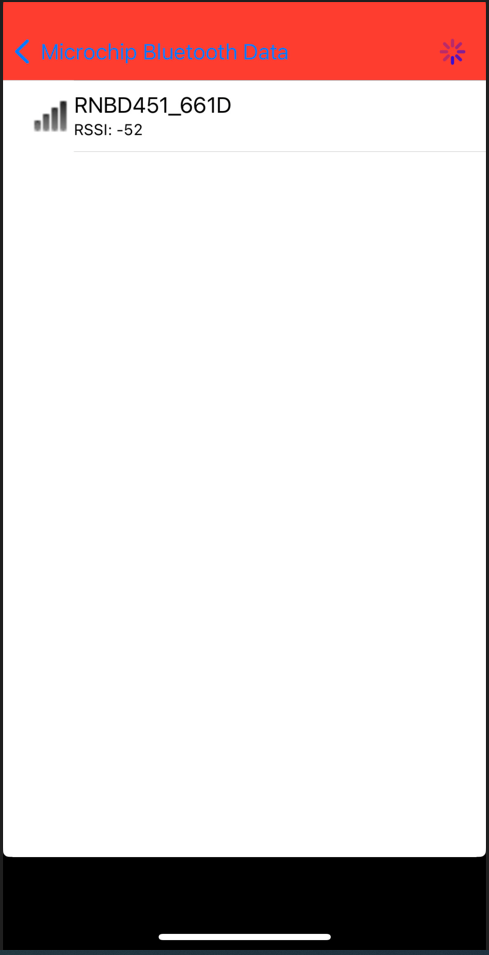

5. Click on intended device from the scanned list. Mobile app will now establish a connection with OTA Target device.

    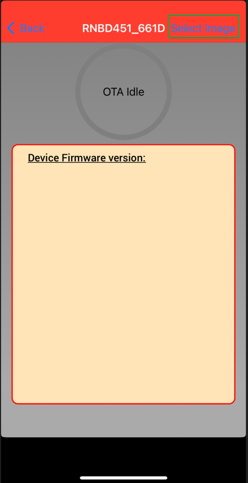

6. Click the ‘Select Image’ option to choose the available firmware file.

7. The OTAU firmware image file copied in the step 1 will be visible on screen. Click on that image.

    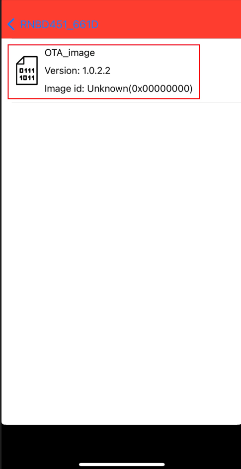

8. After confirming the firmware version, user should press the "OK" button within the MBD app to proceed with any necessary updates or changes.

    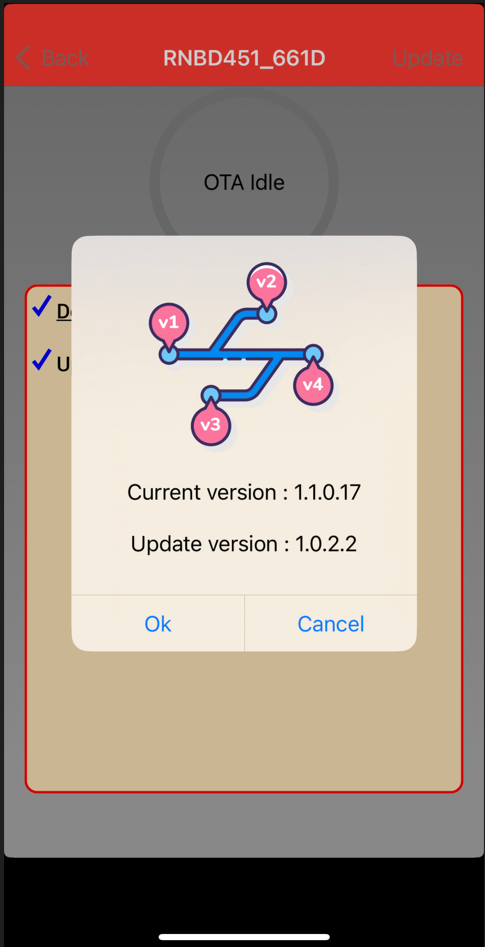

9. MBD app will begin to show the progress of the update on the screen. This may take a few seconds to complete, depending on the size of the firmware update.

    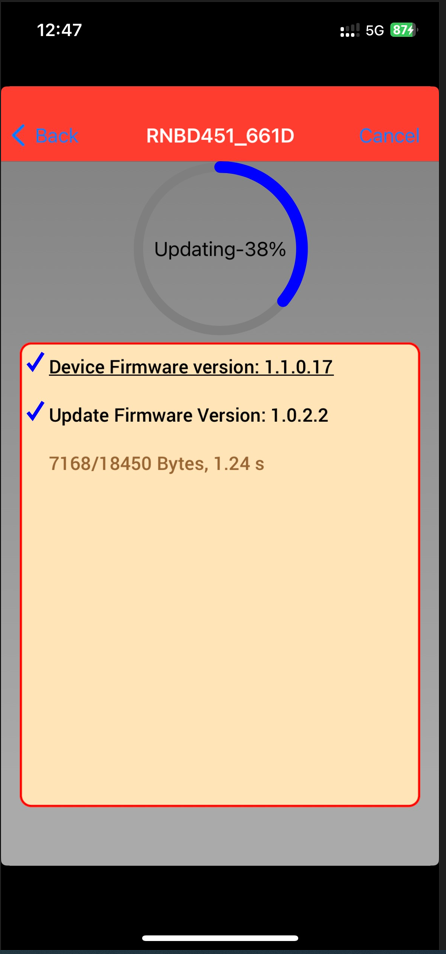

10. The mobile app will display "OTA Update successfully" when the image transfer is complete. Press "OK" and then device will perform authentication of the image. If the verification passes, the device will show the status to the user and MBD app will disconnect automatically.

    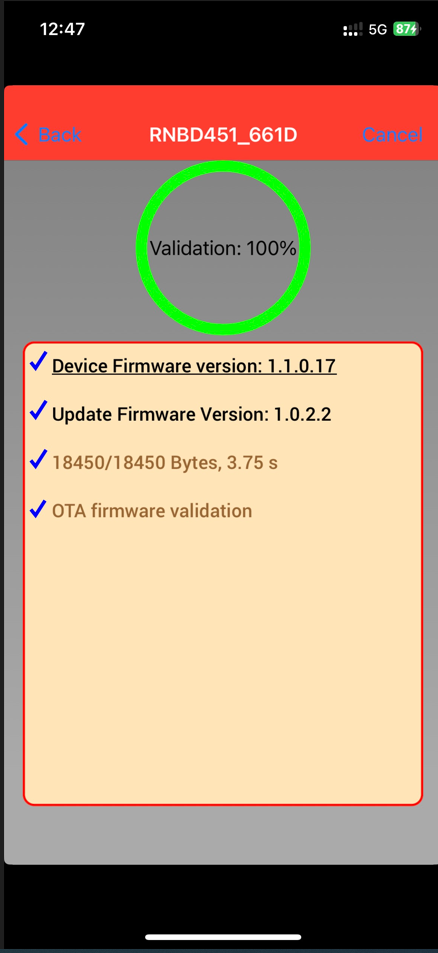

    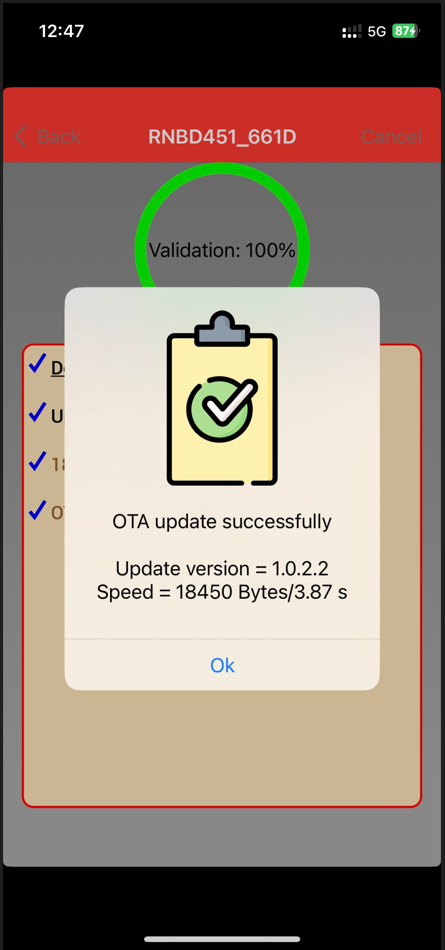

 - **Android Mobile**

    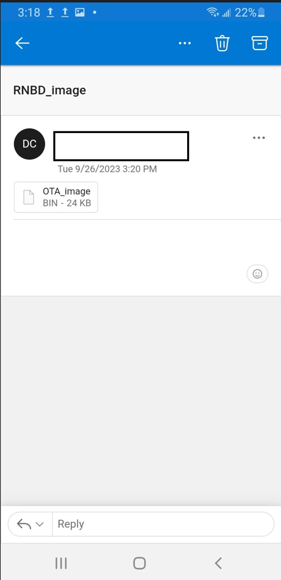

    - Please click on the binary file attached and then select open with MBD app option, as shown in the screenshot below.

    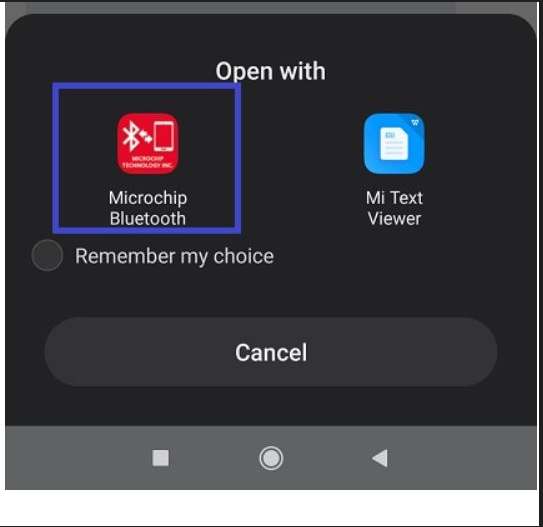

    - Click save button as shown below

    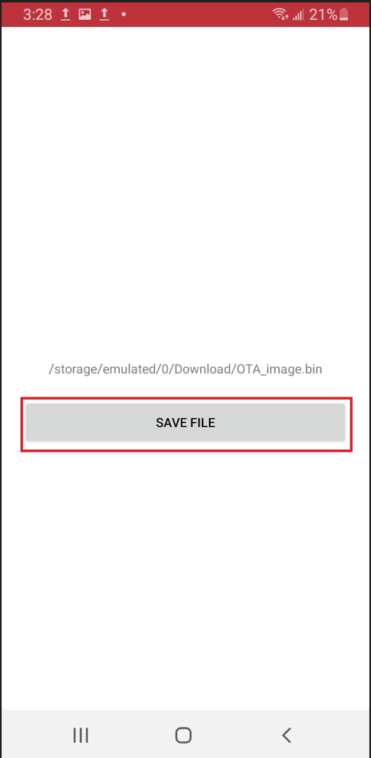

To do the firmware update process, simply follow the same steps as before starting from step 2. Additionally, ensure that the necessary Bluetooth permissions are enabled for the MBD app during MBD app installation process.

During step 5, you should wait for the "Connected" message to appear on the screen before proceeding to step 6. (Only for Android Devices)

