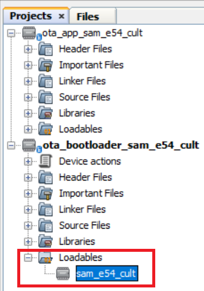
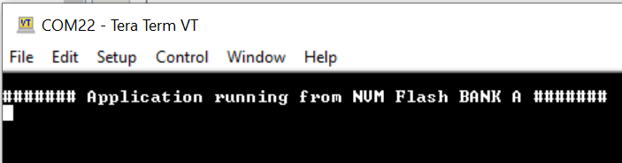
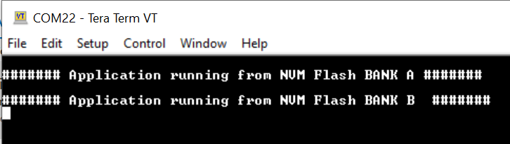

# Building and Running the OTA Bootloader applications

## Downloading and building the application

To clone or download this application from Github,go to the [main page of this repository](https://github.com/Microchip-MPLAB-Harmony/bootloader_apps_ota) and then click Clone button to clone this repo or download as zip file. This content can also be download using content manager by following [these instructions](https://github.com/Microchip-MPLAB-Harmony/contentmanager/wiki)

Path of the application within the repository is **apps/ble/dual_bank/**

To build the application, refer to the following table and open the project using its IDE.

### OTA Bootloader

| Project Name      | Description                                    |
| ----------------- | ---------------------------------------------- |
| ota_bootloader/firmware/sam_e54_cult.X    | MPLABX Project for [SAM E54 Curiosity Ultra Development Board](https://www.microchip.com/en-us/development-tool/dm320210)|

### OTA application

| Project Name      | Description                                    |
| ----------------- | ---------------------------------------------- |
| ota_app/firmware/sam_e54_cult.X    | MPLABX Project for [SAM E54 Curiosity Ultra Development Board](https://www.microchip.com/en-us/development-tool/dm320210)|

## Setting up [SAM E54 Curiosity Ultra Development Board](https://www.microchip.com/en-us/development-tool/dm320210)

- To run the demo, the following additional hardware are required:
  - [RNBD451 Add On Board](https://www.microchip.com/en-us/development-tool/ev25f14a)

- Short J2-1 and J2-2 using jumper in the [RNBD451 Add On Board](https://www.microchip.com/en-us/development-tool/ev25f14a)
- Insert [RNBD451 Add On Board](https://www.microchip.com/en-us/development-tool/ev25f14a) board into MIKROBUS Connector.
- Connect the Debug USB port on the board to the computer using a micro USB cable
- Note - [SAM E54 Curiosity Ultra Development Board](https://www.microchip.com/en-us/development-tool/dm320210) version 2 (v2) board is used to test this demo.

## Running the Application

1. Open the OTA bootloader project *ota_bootloader/firmware/sam_e54_cult.X* in the IDE

2. Make sure that the *ota_app/firmware/sam_e54_cult.X* is added as a loadable project to OTA bootloader project
    - As the Dual Bank Flash memory may not have any valid binary **required by OTA bootloader** for the first time, Adding the **ota_app as loadable** allows MPLAB X to create a **unified hex file** and program both these applications in their respective memory locations based on their linker script configurations

    

3. Build the **OTA bootloader application** using the IDE (Do not program)

4. Go to the **\<harmony3_path\>/bootloader_apps_ota/apps/ble/dual_bank/ota_bootloader/firmware/sam_e54_cult.X/dist/sam_e54_cult/production/** directory and open the command prompt to run the below command

        python <harmony3_path>/bootloader_apps_ota/tools/hex_merge.py -o sam_e54_cult.X.production.unified.hex -a sam_e54_cult.X.production_inactive_bank.hex

    - sam_e54_cult.X.production_inactive_bank.hex is created through post build command in the OTA bootloader project to create additional Bootloader HEX file for the inactive bank. The *hex_merge* python script is used to combine unified HEX file (Bootloader and application in active bank) and bootloader inactive bank HEX file (Bootloader in inactive bank). Once command is executed successfully then **sam_e54_cult.X.production.unified.hex** is updated and it contains bootloader inactive bank hex file along with active bank bootloader hex file and active bank application hex file. 

5. Open the Terminal application (Ex.:Tera Term) on the computer
6. Connect to the Virtual COM port and configure the serial settings as follows:
    - Baud : 115200
    - Data : 8 Bits
    - Parity : None
    - Stop : 1 Bit
    - Flow Control : None

7. Program updated **sam_e54_cult.X.production.unified.hex** using MPLAB X IPE or MPLAB X IDE.
	
8. Once programming is done OTA bootloader starts execution and directly jumps to application space to **run the OTA application**
    - **LED1** starts blinking indicating that the **OTA application** is running
	- Observe the below message on console

    

9. Go to the **\<harmony3_path\>/bootloader_apps_ota/apps/ble/dual_bank/ota_app/firmware/sam_e54_cult.X/dist/sam_e54_cult/production/** directory and open the command prompt to run the below command

        python <harmony3_path>/bootloader_apps_ota/tools/ota_host_mcu_header.py -p 0x82000 -j 0x2000 -f sam_e54_cult.X.production.bin

    - This command adds OTA Host MCU Header to the application binary. If command executed successful then "image.bin is generated successfully" message display on the command prompt.

10. Run the below command

        python <harmony3_path>/bootloader_apps_ota/tools/ota_rnbd_header.py -f image.bin

    - This command adds OTA RNBD Header to the image.bin and generates **RNBD_image.bin** application binary. If command executed successful then "RNBD_image.bin is generated successfully" message display on the command prompt.

11. Refer [Send application binary using MBD App](../../docs/readme_ota_app.md) to program **RNBD_image.bin** application binary to the target.

12. Once Firmware Update is successful
    - **LED1** still blinking indicating that the **OTA application** is running
	- Observe the below message on console

    

13. Repeat Step 11-12.
    - Observe **LED1** still blinking
	- Observe message printed on console **####### Application running from NVM Flash BANK A #######** or **####### Application running from NVM Flash BANK B  #######** alternatively.
