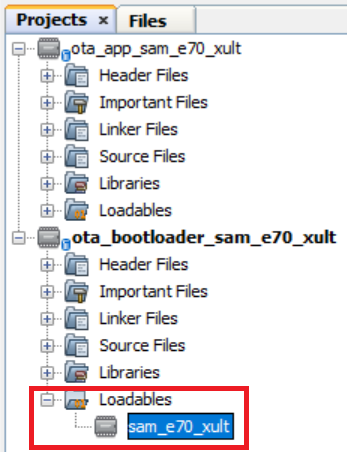
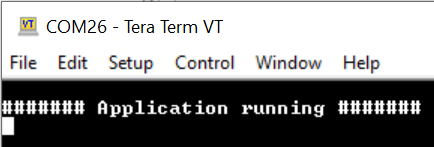
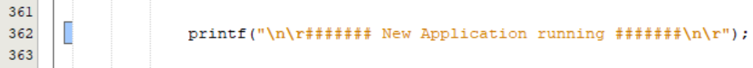
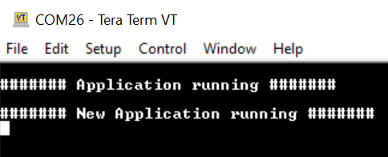

# Building and Running the OTA Bootloader applications

## Downloading and building the application

To clone or download this application from Github,go to the [main page of this repository](https://github.com/Microchip-MPLAB-Harmony/bootloader_apps_ota) and then click Clone button to clone this repo or download as zip file. This content can also be download using content manager by following [these instructions](https://github.com/Microchip-MPLAB-Harmony/contentmanager/wiki)

Path of the application within the repository is **apps/ble/external_memory/**

To build the application, refer to the following table and open the project using its IDE.

### OTA Bootloader

| Project Name      | Description                                    |
| ----------------- | ---------------------------------------------- |
| ota_bootloader/firmware/sam_e70_xult.X    | MPLABX Project for [SAM E70 Xplained Ultra Evaluation Kit](https://www.microchip.com/DevelopmentTools/ProductDetails/PartNO/DM320113)|

### OTA application

| Project Name      | Description                                    |
| ----------------- | ---------------------------------------------- |
| ota_app/firmware/sam_e70_xult.X    | MPLABX Project for [SAM E70 Xplained Ultra Evaluation Kit](https://www.microchip.com/DevelopmentTools/ProductDetails/PartNO/DM320113)|

## Setting up [SAM E70 Xplained Ultra Evaluation Kit](https://www.microchip.com/DevelopmentTools/ProductDetails/PartNO/DM320113)
- To run the demo, the following additional hardware are required:
  - [RNBD451 Add On Board](https://www.microchip.com/en-us/development-tool/ev25f14a)
  - [mikroBUS Xplained Pro board](https://www.microchip.com/developmenttools/ProductDetails/ATMBUSADAPTER-XPRO)

- Short J2-1 and J2-2 using jumper in the [RNBD451 Add On Board](https://www.microchip.com/en-us/development-tool/ev25f14a)
- Install an [RNBD451 Add On Board](https://www.microchip.com/en-us/development-tool/ev25f14a) on to the [mikroBUS Xplained Pro board](https://www.microchip.com/developmenttools/ProductDetails/ATMBUSADAPTER-XPRO)
- Connect [mikroBUS Xplained Pro board](https://www.microchip.com/developmenttools/ProductDetails/ATMBUSADAPTER-XPRO) to the EXT1 header
- Connect the Debug USB port on the board to the computer using a micro USB cable

## Running the Application

1. Open the OTA bootloader project *ota_bootloader/firmware/sam_e70_xult.X* in the IDE

2. Make sure that the *ota_app/firmware/sam_e70_xult.X* is added as a loadable project to OTA bootloader application
    - As the external memory may not have any valid binary **required by OTA bootloader** for the first time, Adding the **ota_app as loadable** allows MPLAB X to create a **unified hex file** and program both these applications in their respective memory locations based on their linker script configurations

    

3. Open the Terminal application (Ex.:Tera Term) on the computer
4. Connect to the Virtual COM port and configure the serial settings as follows:
    - Baud : 115200
    - Data : 8 Bits
    - Parity : None
    - Stop : 1 Bit
    - Flow Control : None

5. Build and program the **OTA bootloader application** using the IDE

6. Once programming is done OTA bootloader starts execution and directly jumps to application space to **run the OTA application**
    - **LED1** starts blinking indicating that the **OTA application** is running
	- Observe the below message on console

    

7. Open the OTA application project ota_app/firmware/sam_e70_xult.X in the IDE

8. Update ota_app/firmware/src/app.c to update printf() message from **####### Application running #######** to **####### New Application running #######** as below

    

9. Clean and Build the OTA application project to generate the binary (Do not program the binary)

10. Go to the **\<harmony3_path\>/bootloader_apps_ota/apps/ble/external_memory/ota_app/firmware/sam_e70_xult.X/dist/sam_e70_xult/production/** directory and open the command prompt to run the below command

        python <harmony3_path>/bootloader_apps_ota/tools/ota_host_mcu_header.py -p 0x402000 -j 0x402000 -l 0x0 -f sam_e70_xult.X.production.bin

    - This command adds OTA Host MCU Header to the application binary. If command executed successful then "image.bin is generated successfully" message display on the command prompt.

11. Run the below command

        python <harmony3_path>/bootloader_apps_ota/tools/ota_rnbd_header.py -f image.bin

    - This command adds OTA RNBD Header to the image.bin and generates **RNBD_image.bin** application binary. If command executed successful then "RNBD_image.bin is generated successfully" message display on the command prompt.

12. Refer [Send application binary using MBD App](../../docs/readme_ota_app.md) to program **RNBD_image.bin** application binary to the target.

13. Once Firmware Update is successful
    - **LED1** still blinking indicating that the **OTA application** is running
	- Observe the below message on console

    

13. Repeat Step 8-13.
    - Observe **LED1** still blinking
	- Observe message printed on console
