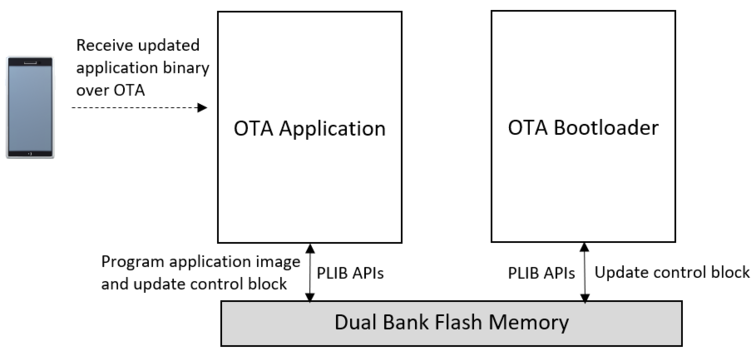

# OTA Bootloader - Dual Bank

This example application shows how to use the OTA Bootloader Library to bootload an application on device having dual bank flash using RNBD.

**OTA Bootloader and Applications Block Diagram**

**OTA Bootloader**

-   This is a OTA bootloader which resides from

    -   The starting location of the flash memory region for SAM devices

    -   The starting location of the Boot flash memory region for PIC32M devices

        -   Uses a Custom linker script **btl.ld** to place it in Boot flash memory

**Performs Below Operation:**

1.  Read the **control block** stored in the last sector of dual bank memory

2.  Checks if **blockUpdated** field is set to 1, then it will update the control block

    -   SAM devices - If **blockUpdated** field is set to 0 then it jumps to **Step 4**

    -   PIC32M devices - If **blockUpdated** field is set to 0 then map Program Flash Bank with higher serial number to the lower region and then it jumps to **Step 4**

3.  Set **blockUpdated** field to 0 and then update the **control block** in the dual bank flash memory. And perform the following operation.

    -   SAM devices - Swap bank and trigger reset

    -   PIC32M devices - Trigger reset

4.  Run OTA application as below

    -   Calls the SYS\_Deinitialize\(\) function which releases the resources used. **This Function is device specific and has to be implemented based on application requirement**

    -   **Jumps to application space to run the OTA application** **OTA Application**

-   This is a OTA application which resides from

    -   The end of bootloader size in device flash memory for SAM devices

    -   The start of Program Flash memory for PIC32M devices

        -   Uses a Custom linker script **app\_mz.ld**/**app\_mk.ld** to place it in Program flash memory

-   It blinks an LED and provides console output

-   It calls the OTA\_SERVICE\_Tasks\(\) function which receives the binary over OTA to be programmed into the inactive flash bank

-   Once the binary is received and programmed into the inactive flash bank, it generates a CRC32 value over programmed inactive flash bank space and verifies it against the received CRC32

-   If verification is successful then it updates the **control block** and trigger reset to run new application binary through OTA bootloader

**Development Kits** The following table provides links to documentation on how to build and run OTA bootloader and application on different development kits

-   **[PIC32MK MCM Curiosity Pro Board: Building and Running the OTA Bootloader applications](GUID-32E7C792-B846-4055-ACFF-5493AD1CF015.md)**  

-   **[Curiosity PIC32MZ EF 2.0 Development Board: Building and Running the OTA Bootloader applications](GUID-F3ED85E5-AEE1-4FFE-BDC4-745C11F4731B.md)**  

-   **[SAM E54 Curiosity Ultra Development Board: Building and Running the OTA Bootloader applications](GUID-AF4E5EA9-1680-4C2A-A355-7AB2E0ACC4C6.md)**  

-   **[SAM E54 Xplained Pro Evaluation Kit: Building and Running the OTA Bootloader applications](GUID-6FA87DBD-BC1E-405A-9B05-9ADF83B20595.md)**  

**Parent topic:**[MPLAB® Harmony 3 OTA Bootloader Application Examples](GUID-D3602325-EE26-4349-B13C-9A4F4648DC3D.md)

