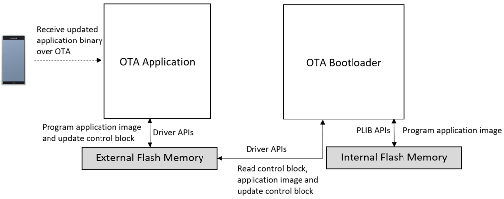

# OTA Bootloader - External Memory

This example application shows how to use the OTA Bootloader Library to bootload an application on board having external memory using RNBD.

**OTA Bootloader and Applications Block Diagram**

**OTA Bootloader**

-   This is a OTA bootloader which resides from

    -   The starting location of the flash memory region for SAM devices

    -   The starting location of the Boot flash memory region for PIC32M devices

        -   Uses a Custom linker script **btl.ld** to place it in Boot flash memory

**Performs Below Operation:**

1.  Read the **control block** stored in the last sector of external memory

2.  Checks if **blockUpdated** field is set to 1, then it will update the application binary

    -   If **blockUpdated** field is set to 0 then it jumps to **Step 6**

3.  If application update is required then it

    -   Reads the OTA application binary stored from **loadAddress** in the external memory

    -   Programs the read binary to **programAddress** in the Internal Flash

4.  Once programming is done it generates a CRC32 value over programmed space and verifies it against the CRC32 stored in external memory **control block**

5.  If verification is successful then set **blockUpdated** field to 0 and then update the **control block** in the external memory and trigger reset.

6.  Run OTA application as below

    -   Calls the SYS\_Deinitialize\(\) function which releases the resources used. **This Function is device specific and has to be implemented based on application requirement**

    -   **Jumps to application space to run the OTA application**

**OTA Application**

-   This is a OTA application which resides from

    -   The end of bootloader size in device flash memory for SAM devices

    -   The start of Program Flash memory for PIC32M devices

        -   Uses a Custom linker script **app\_mz.ld**/**app\_mk.ld** to place it in Program flash memory

-   It blinks an LED and provides console output

-   It calls the OTA\_SERVICE\_Tasks\(\) function which receives the binary over OTA to be programmed into the external memory

-   Once the binary is received and programmed into the external memory, it generates a CRC32 value over programmed external memory space and verifies it against the received CRC32

-   If verification is successful then it updates the **control block** and trigger reset to run new application binary through OTA bootloader

**Development Kits** The following table provides links to documentation on how to build and run OTA bootloader and application on different development kits

-   **[SAM D21 Xplained Pro Evaluation Kit: Building and Running the OTA Bootloader applications](GUID-2D290CA4-9AFB-4E39-9BDF-DE6D1728E96F.md)**  

-   **[SAM E54 Curiosity Ultra Development Board: Building and Running the OTA Bootloader applications](GUID-D948268A-DE06-480D-98D5-B63D263617EB.md)**  

-   **[SAM E70 Xplained Ultra Evaluation Kit: Building and Running the OTA Bootloader applications](GUID-72B4F744-78F4-43B3-80EB-ACCB334811B8.md)**  

**Parent topic:**[MPLAB® Harmony 3 OTA Bootloader Application Examples](GUID-D3602325-EE26-4349-B13C-9A4F4648DC3D.md)

