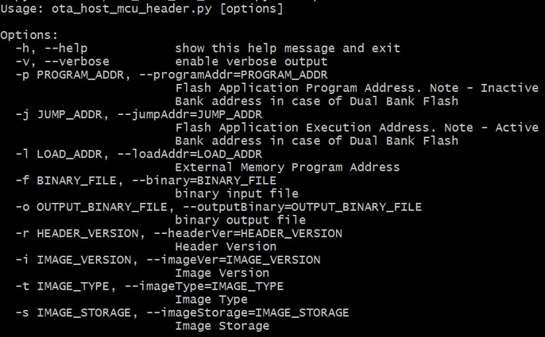
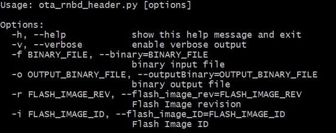
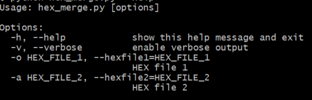

# OTA Bootloader Host Script Help

The following python scripts are used in order to update the application binary image

1.  ota\_host\_mcu\_header.py - This script will add the OTA Host MCU Header to the application binary and image.bin will be generated as intermediate output binary image. Path of the tool within the bootloader application repository is **tools/ota\_host\_mcu\_header.py**

2.  ota\_rnbd\_header.py - This script will add the OTA RNBD Header to the image.bin intermediate binary and it generates RNBD\_image.bin application binary as final output binary image. Path of the tool within the bootloader application repository is **tools/ota\_rnbd\_header.py**


The following steps to be performed to update the application binary image

**Step 1:** Run ota\_host\_mcu\_header.py script. Below is the syntax to show help menu for the script

```c
python <harmony3_repo_path>/tools/ota_host_mcu_header.py --help
```

Below syntax and example



Description

-   It should be used with -p \(--programAddr\) option to specify Flash Application Program Address

-   It should be used with -j \(--jumpAddr\) option to specify Flash Application Execution Address

-   It should be used with -f \(--binary\) option to specify binary input file

-   In case of external memory only, It should be used with -l \(--loadAddr\) option to specify External Memory Program Address


**Dual Bank:**

```c
python <harmony3_repo_path>/tools/ota_host_mcu_header.py -p 0x82000 -j 0x2000 -f sam_e54_xpro.X.production.bin
```

**External Memory:**

```c
python <harmony3_repo_path>/tools/ota_host_mcu_header.py -p 0x402000 -j 0x402000 -l 0x0 -f sam_e70_xult.X.production.bin
```

**Step 2:** Run ota\_rnbd\_header.py script. Below is the syntax to show help menu for the script

```c
python <harmony3_path>/bootloader_apps_ota/tools/ota_rnbd_header.py --help
```

Below syntax and example



Description

-   It should be used with -f \(--binary\) option to specify binary input file


**Dual Bank/External Memory:**

```c
python <harmony3_path>/bootloader_apps_ota/tools/ota_rnbd_header.py -f image.bin
```

Once command is executed successfully then it generates **RNBD\_image.bin** final application binary image

**For Cortex-M based Dual Bank Devices**

-   User can generate an additional inactive bank bootloader hex file through post build command in the OTA bootloader project. The hex\_merge python script can be used to combine unified HEX file \(for Bootloader and application in active bank\) and bootloader inactive bank HEX file \(for Bootloader in inactive bank\)


```c
python hex_merge.py --help
```

Below syntax and example



Description

-   It should be used with -o \(--hexfile1\) option to specify an unified HEX file \(for Bootloader and application in active bank\)

-   It should be used with -a \(--hexfile2\) option to specify a bootloader inactive bank HEX file


```c
python <harmony3_path>/bootloader_apps_ota/tools/hex_merge.py -o sam_e54_xpro.X.production.unified.hex -a sam_e54_xpro.X.production_inactive_bank.hex
```

Once command is executed successfully then sam\_e54\_xpro.X.production.unified.hex is updated and it contains bootloader inactive bank hex file along with active bank bootloader hex file and active bank application hex file

**Parent topic:**[MPLAB® Harmony 3 OTA Bootloader Application Examples](GUID-D3602325-EE26-4349-B13C-9A4F4648DC3D.md)

